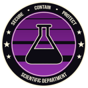

# INFORMATION


**!! NOTICE !!**

This document has currently been made public\
to the following:

**Scientific Personnel**

**MTF Personnel \[ SC-1+ ]**

**Security Personnel \[ SC-1+]**

**Ethics Personnel \[ SC-1+ ]**


  

   

Welcome to the Scientific Department Database. This database will hold all known information on SCPs contained at Paragon Research Institute. The purpose of this document is to share valuable information about SCPs to all Personnel in the Foundation.


All information found within the database is published by a select group of individuals, who are responsible for maintaining, updating, and publishing all information.

If you notice any incorrect or inaccurate information, please forward the information to a member of the **Scientific Department Command Team**.

